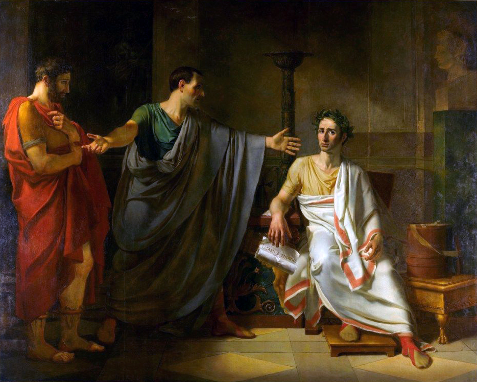

# Handout Template

**Course ID and Term**\

## Instructions

Lorem ipsum dolor sit amet, consectetur adipiscing elit, sed do eiusmod tempor incididunt ut labore et dolore magna aliqua. Ut enim ad minim veniam, quis nostrud exercitation ullamco laboris nisi ut aliquip ex ea commodo consequat. Duis aute irure dolor in reprehenderit in voluptate velit esse cillum dolore eu fugiat nulla pariatur. Excepteur sint occaecat cupidatat non proident, sunt in culpa qui officia deserunt mollit anim id est laborum.

## Document: _De finibus bonorum et malorum_ I (45 BCE)

Non eram nescius, Brute, cum, quae summis ingeniis exquisitaque doctrina philosophi Graeco sermone tractavissent, ea Latinis litteris mandaremus, fore ut hic noster labor in varias reprehensiones incurreret; nam quibusdam, et iis quidem non admodum indoctis, totum hoc displicet philosophari. Quidam autem non tam id reprehendunt, si remissius agatur, sed tantum studium tamque multam operam ponendam in eo non arbitrantur. Erunt etiam, et hi quidem eruditi Graecis litteris, contemnentes Latinas, qui se dicant in Graecis legendis operam malle consumere. Postremo aliquos futuros suspicor, qui me ad alias litteras vocent, genus hoc scribendi, etsi sit elegans, personae tamen et dignitatis esse negent.

## Document: _De finibus bonorum et malorum_ II (45 BCE)

Hic cum uterque me intueretur seseque ad audiendum significarent paratos, Primum, inquam, deprecor, ne me tamquam philosophum putetis scholam vobis aliquam explicaturum, quod ne in ipsis quidem philosophis magnopere umquam probavi. quando enim Socrates, qui parens philosophiae iure dici potest, quicquam tale fecit? eorum erat iste mos qui tum sophistae nominabantur, quorum e numero primus est ausus Leontinus Gorgias in conventu poscere quaestionem, id est iubere dicere, qua de re quis vellet audire. audax negotium, dicerem impudens, nisi hoc institutum postea translatum ad philosophos nostros esset.
